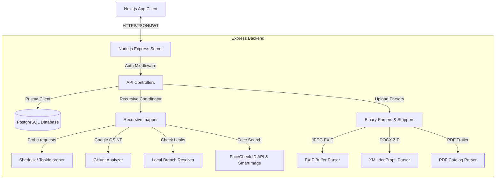
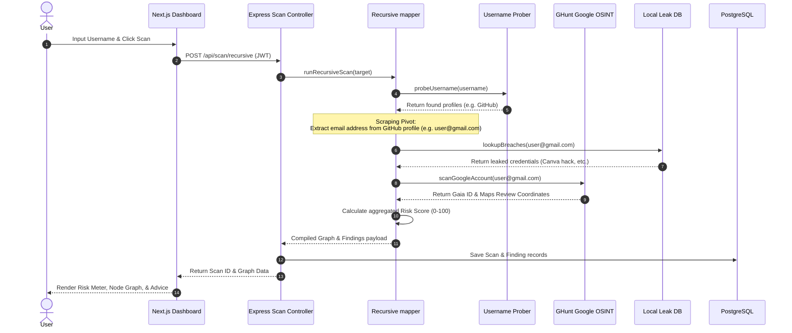

# UML, ER & Architecture Diagrams

This document contains Mermaid diagrams illustrating the database design, sequence flows, use cases, and software architecture of the Aegis platform.

---

## 1. Entity-Relationship (ER) Diagram

Describes the PostgreSQL tables and relations mapped by Prisma ORM:

```mermaid
erDiagram
    USER ||--o{ SCAN : triggers
    USER ||--o{ CLEANING_TASK : manages
    USER ||--o{ AUDIT_LOG : generates
    SCAN ||--o{ FINDING : contains

    USER {
        string id PK
        string email UNIQUE
        string passwordHash
        string name
        enum role
        datetime createdAt
        datetime updatedAt
    }

    SCAN {
        string id PK
        string userId FK
        string target
        enum type
        int riskScore
        datetime createdAt
      }

    FINDING {
        string id PK
        string scanId FK
        string category
        string severity
        string title
        string description
        string remediation
        string rawJson
        datetime createdAt
    }

    CLEANING_TASK {
        string id PK
        string userId FK
        string title
        string category
        string details
        string optOutUrl
        boolean isCompleted
        datetime sentDate
        datetime createdAt
    }

    AUDIT_LOG {
        string id PK
        string userId FK
        string action
        string details
        datetime createdAt
    }

    FEEDBACK {
        string id PK
        string name
        string email
        string message
        datetime createdAt
    }
```

---

## 2. System Architecture Diagram

Highlights the decoupled client-server structure and self-contained OSINT modules:



---

## 3. Scan & Pivot Sequence Diagram

Illustrates the recursive data flow when running an OSINT username check:



---

## 4. UML Use Case Diagram

Defines user and administrator capabilities:

```mermaid
leftToRightDirection
actor User
actor Admin

rectangle Aegis Platform {
    User --> (Register / Login)
    User --> (Run Footprint Scan)
    User --> (Upload & Strip File Metadata)
    User --> (Generate GDPR/DPDP Opt-Out Letters)
    User --> (Track Cleaning checklist Tasks)
    User --> (Export Profile Data)
    User --> (Delete Account)
    
    Admin --> (View System Health Stats)
    Admin --> (Manage Registered Users)
    Admin --> (View Audit Security Logs)
    Admin --> (Clear Feedback Inbox)
}
```
